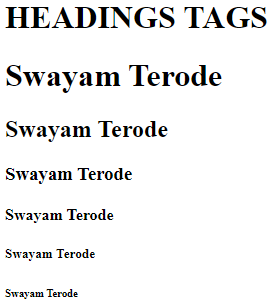
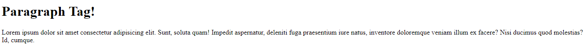
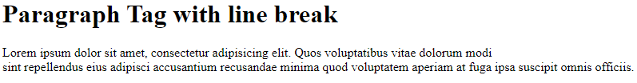
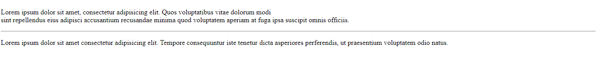

# HTML

**Step 1:** I am using VS CODE, so we can use the keyword `doc` and hit `enter` in the `.html` file

## Heading

<details>

```html
<h1>Swayam Terode</h1>
<h2>Swayam Terode</h2>
<h3>Swayam Terode</h3>
<h4>Swayam Terode</h4>
<h5>Swayam Terode</h5>
<h6>Swayam Terode</h6>
```

✔️ **OUTPUT**



</details>

## Paragraph

<details>

```html
<p>
  Lorem ipsum dolor sit amet consectetur adipisicing elit. Sunt, soluta quam!
  Impedit aspernatur, deleniti fuga praesentium iure natus, inventore doloremque
  veniam illum ex facere? Nisi ducimus quod molestias? Id, cumque.
</p>
```

Anything in `<p> SOME TEXT</p>` is paragraph.

✔️ **OUTPUT**



</details>

## Line break

<details>

Line break is added in HTML with the help of `<br> OR </br>` both are same.

```HTML
<h1>Paragraph Tag with line break</h1>
    <p>Lorem ipsum dolor sit amet, consectetur adipisicing elit. Quos voluptatibus vitae dolorum modi <br>sint
        repellendus eius adipisci accusantium recusandae minima quod voluptatem aperiam at fuga ipsa suscipit omnis
        officiis.</p>
```

✔️ **OUTPUT**



> One line break breaks the entire para and adds a line break!

</details>

## Horizontal Rule

<details>

Adds horizontal line

```HTML
<h1>Paragraph Tag with line break</h1>
    <p>Lorem ipsum dolor sit amet, consectetur adipisicing elit. Quos voluptatibus vitae dolorum modi <br>sint
        repellendus eius adipisci accusantium recusandae minima quod voluptatem aperiam at fuga ipsa suscipit omnis
        officiis.</p>
    <hr>
    <p>Lorem ipsum dolor sit amet consectetur adipisicing elit. Tempore consequuntur iste tenetur dicta asperiores
        perferendis, ut praesentium voluptatem odio natus.</p>
```

✔️ **OUTPUT**



> See the horizontal line gets added

</details>
