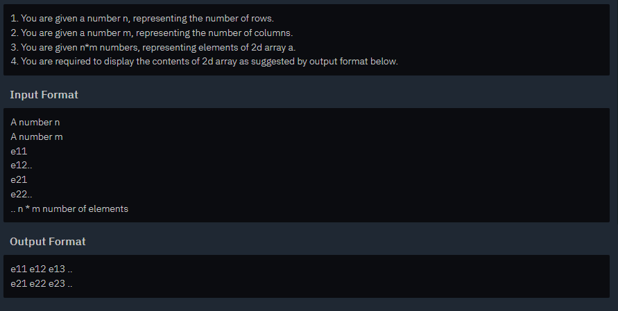
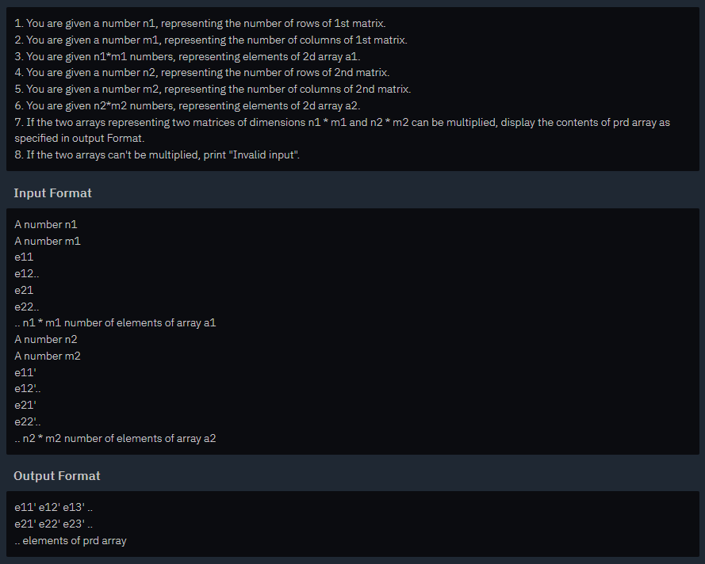
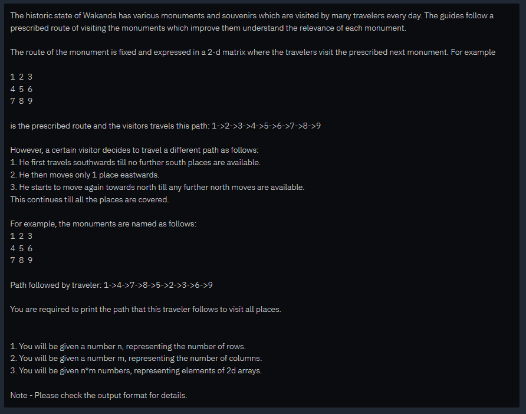
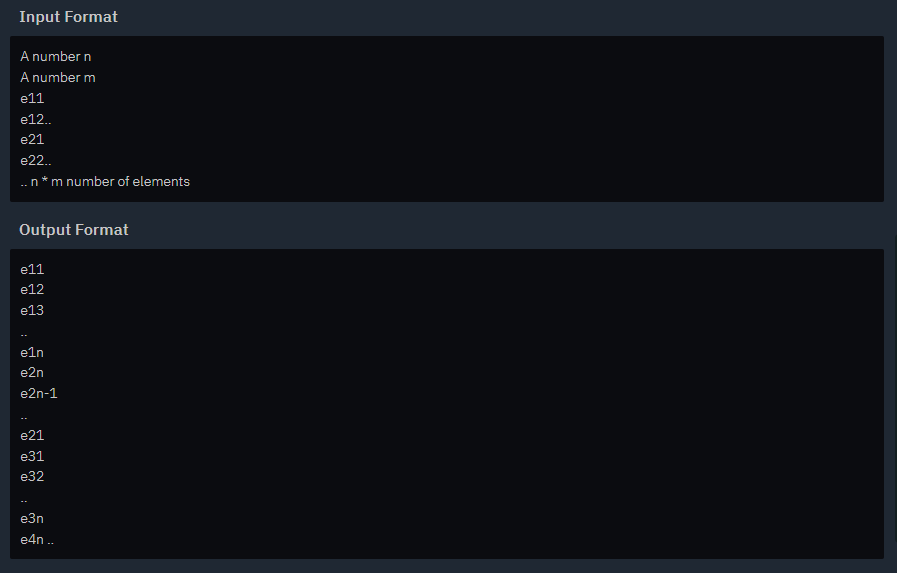

# 2d Array

## 1. 2d Arrays Demo

<details>

**Problem Statement :**



**Sample Output:**

```cpp
2
4
11
12
13
14
21
22
23
24
```


**C++ Solution** ✔️

<details>

```cpp

#include <bits/stdc++.h>
using namespace std;
int main()
{
    int n, m;
    cin >> n >> m;

    vector<vector<int>> arr;
    //input
    for (int i = 0; i < n; i++)
    {
        vector<int> sarr;
        for (int j = 0; j < m; j++)
        {
            int element;
            cin >> element;
            sarr.push_back(element);
        }
        arr.push_back(sarr);
    }

    //Output
    for (int i = 0; i < n; i++)
    {
        for (int j = 0; j < m; j++)
        {
            cout << arr[i][j] << " ";
        }
        cout << endl;
    }
    return 0;
}

```

</details>

</details>

## 2. Matrix Multiplication

<details>

**Problem Statement :**




Sample Input:

```cpp
2
3
10
0
0
0
20
0
3
4
1
0
1
0
0
1
1
2
1
1
0
0
```


**C++ Solution** ✔️

<details>

```cpp
#include<iostream>
#include<vector>

using namespace std;

void matrixMult(vector<vector<int>> A, vector<vector<int>> B){
    int r1 = A.size();
    int c1 = A[0].size();
    int r2 = B.size();
    int c2 = B[0].size();

    if(c1 != r2)
    {
        cout<<"Invalid input";
        return;
    }
    vector<vector<int>> pdt;
    for(int i = 0; i<r1; i++) {
        vector<int> arr;
    for(int j = 0; j<c2; j++){
        int mul = 0;
        for(int k = 0; k<c1; k++){
            mul += (A[i][k] * B[k][j]);
        }
        arr.push_back(mul);
    }
    pdt.push_back(arr);
}

for(int i = 0; i<r1; i++) {
    for(int j= 0; j<c2; j++){
        cout<<pdt[i][j]<<" ";
    }
    cout<<endl;
}
}

int main(){
    int r1;
    int c1;
    cin>>r1;
    cin>>c1;

    vector<vector<int>> mat1;
    for(int i= 0; i< r1; i++){
        vector<int> arr;
        for(int j= 0; j< c1; j++){
            int ele;
            cin>> ele;
            arr.push_back(ele);
        }
        mat1.push_back(arr);
    }

    int r2;
    int c2;
    cin>>r2;
    cin>>c2;

    vector<vector<int>> mat2;
    for(int i= 0; i< r2; i++){
        vector<int> arr;
        for(int j= 0; j< c2; j++){
            int ele;
            cin>> ele;
            arr.push_back(ele);
        }
        mat2.push_back(arr);
    }

    matrixMult(mat1, mat2);
}
```

</details>

</details>

## 3. The State Of Wakanda - 1

<details>

**Problem Statement:**






**Sample Input:**

```cpp
3
4
11
12
13
14
21
22
23
24
31
32
33
34
```

**Sample Output:**

```cpp
11
21
31
32
22
12
13
23
33
34
24
14
```

**C++ Solution** ✔️

<details>

```cpp
#include<iostream>
#include<vector>

using namespace std;

void columnTraversal(vector<vector<int>> mat) {
  int row = mat.size();
  int col = mat[0].size();

  for (int i = 0; i < col; i++) {
    if (i % 2 == 0) {
      for (int j = 0; j < row; j++) {
        cout << mat[j][i] << endl;
      }
    }
    else {
      for (int j = row - 1; j >= 0; j--) {
        cout << mat[j][i] << endl;
      }
    }
  }
}

int main() {
  int n;
  int m;
  cin >> n;
  cin >> m;

  vector<vector<int>> mat;
  for (int i = 0; i < n; i++) {
    vector<int> arr;
    for (int j = 0; j < m; j++) {
      int ele;
      cin >> ele;
      arr.push_back(ele);
    }
    mat.push_back(arr);
  }

  columnTraversal(mat);
}
```

</details>

</details>
