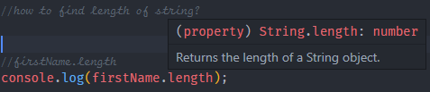
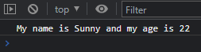

<div align = "center">

# JavaScript 

</div>

## Variables, Identifiers, Datatypes

<details>

### 1.Variables

<details>

Variables are containers used to store the data.

There are 4 ways to declare a variable:

- Using `var`
- Using `let`
- Using `const`
- Using nothing

**Let us understand with an example:**

```cpp
var x = 5;
var y = 65;
var z = x + y;
```

In the above example `x`, `y` and `z` are variables, which are declared with the help of the `var` keyword.

**All the three words `var`, `const`, and `let` are the same.**

#### When to use JS var?

```MD
- We use the var keyword in JS code from 1995 to 2015.
- If we want our code must run in old browsers then use var
- The let & const keywords were added to JS in 2015.
```

#### Now when to use let and const?

```MD
If you want a general rule: always declare variables with const.

If you think the value of the variable can change, use let.
```

#### Example

```js
const price1 = 34; //this values cannot change so we have used const
const price1 = 44; //this values cannot change so we have used const
let total = price1 + price2;
```

---

</details>

<!---------------------------------------------------------------------------------------------------------------------------------------->

### 2. Identifiers

<details>

All JS **variables** can be identified with unique names.

These unique names are called **identifiers**.

**_RULES for constructing names for variables(unique identifiers) are:_**

- Name can contain letters, digits, underscore, and dollar signs.
- Name must **begin with letter** or **$** and **\_**(underscore).
- Names are case sensitive

</details>

<!-- ---------------------------------------------------------------------------------------------------------------------------------------------------------------->

### 3. Datatypes

<details>

| Data Types  | Description                                        | Example                       |
| ----------- | -------------------------------------------------- | ----------------------------- |
| `String`    | represents textual data                            | 'hello', "hello world!" etc   |
| `Number`    | an integer or a floating-point number              | 3, 3.234, 3e-2 etc.           |
| `BigInt`    | an integer with arbitrary precision                | 900719925124740999n , 1n etc. |
| `Boolean`   | Any of two values: true or false                   | true and false                |
| `undefined` | a data type whose variable is not initialized      | let a;                        |
| `null`      | denotes a null value                               | let a = null;                 |
| `Symbol`    | data type whose instances are unique and immutable | let value = Symbol('hello');  |
| `Object`    | key-value pairs of collection of data              | let student = { };            |

**Examples**:

```js
// types of operator
// data type
// string
// number
// undefined
// null
// BigInt
// Symbol

let age = 34;
console.log("Age =", age);
console.log("Age is type of:", typeof age);
console.log("----------------------");
//conversion of number to string
age = age + "";
console.log("Age =", age);
console.log("Age is type of:", typeof age);
console.log("----------------------");
//34 -> "34"

//convert string to number:
let str = "34" + 47;
console.log("String =", str);
console.log("Type of str :", typeof str);
console.log("----------------------");

age = 3;
age = String(age); //3 converted to string
console.log("Age = ", age); //3
console.log("Type of age:", typeof age); //sting!
console.log("----------------------");

age = 45;
age = Number(age);
console.log("Age =", age);
console.log("typeof Age:", typeof age);
console.log("----------------------");
```

✔️ **OUTPUT**


An example of BigInt()

The above line allows us to use a number that does not fit in the range of `int`. See the below example.

```js
//BigInt
console.log(Number.MAX_SAFE_INTEGER);
```

✔️ **OUTPUT**


Actual usage of BigInt( )

```js
//BigInt
console.log(Number.MAX_SAFE_INTEGER);
let bigNumber = BigInt(123456789123456789);
console.log("BigInt->", bigNumber);
```


**NOTE**:

> 📓 Number with `n` at last of it is BigInt

```js
//another way to define BigInt()

let num1 = 121345n; //declared as BigInt number;
let num2 = 142; // normal number
console.log(num1 + num2);
```

✖️ **OUTPUT**


</details>

</details>

<!-- ---------------------------------------------------------------------------------------------------------------------------------------------------------------->

<div align="left">

## var, let & const

</div>

<!-- ---------------------------------------------------------------------------------------------------------------------------------------------------------------->

  <details>

### 1. var

<details>

Var can store some information and use them later and update that later

- Declaring a keyword

```js
var firstName = "Sunny";
```

- Using a variable

```js
console.log(firstName);
```

**Variable is case sensitive!**

```javascript
"use strict";
//decalring a variable
var firstName = "Sunny";
console.log(firstName); //output
//variables can be assigned to different values
firstName = "Raj";
console.log(firstName); //output
console.log("Everything is fine! i.e. No Errors");
```

**No Error in the above code.**

```js
"use strict";
//decalring a variable
var firstName = "Sunny";
console.log(firstName); //output
//variables can be assigned to different values
firstName = "Raj";
console.log(firstName); //output
console.log("Everything is fine! i.e. No Errors");

lastName = "Deol";
console.log(lastName);
```

**The above code gives the following error:**


The above error has occurred because we have used `"use strict"`.

<!-- ---------------------------------------------------------------------------------------------------------------------------------------------------------------->

### Rules for var

```js
//Rules for defining var
var value1 = 10;
console.log(value1);
//you can also use underscore _ or dollar symbol
//first_name (valid)
//_firstname (valid)

//first$name (valid)
//$firstname (valid)

//you cannot use spaces
// first name (invalid)

//convention
//start with small letter and use camelCase
```

Things **not** to do! 🙅🚫


✔️ Correct Syntax


**Output**:

.png>)

</details>

<!-- ---------------------------------------------------------------------------------------------------------------------------------------------------------------->

### 2. let

<details>

The correct way to define a let keyword is:

```js
let firstName = "Sunny";
firstName = "Raj"; // firstName changed to Raj
console.log(firstName);
```

✔️ **OUTPUT**


- Things to avoid 🙅 🚫

```js
let firstName = "Sunny";
let firstName = "Sunny";
```

✖️ **OUTPUT**


The `let` keyword was introduced in ES6.

| Rules                                                                       |
| :-------------------------------------------------------------------------- |
| **Variables that are defined with `let` cannot be _Redefined_**             |
| **Variables defined with `let` must be defined before we use the variable** |
| **Variables declared with `let` have _Block Scops_**                        |

<!--let block scope -->

**Example:**


From the above error we can say that **we cannot** declare **two variables of the same name with the `let` keyword!**

Another interesting fact:

We can declare the same variables with the help of the `var` keyword having different values, but **cannot** _declare the same variable which we have declared earlier with the `let` keyword. let's understand with the help of **example**_


In the above example, we have declared `x` 4 times, two times with the `let` keyword and two times with the `var` keyword, but this gives an error because we cannot variables that use d by `let` keyword.

But can use a different variable name to see the difference.

<!-- ---------------------------------------------------------------------------------------------------------------------------------------------------------------->

### Block Scope

<!-- ---------------------------------------------------------------------------------------------------------------------------------------------------------------->

Before ES6 (2015), JavaScript had only **Global Scope** and **Function Scope.**

ES6 introduced two important new JavaScript keywords: `let` and `const`.

**These two keywords provide Block Scope in JavaScript.**

Variables declared inside a `{ }` block **cannot** be accessed from **outside** the block:

<table>
<tr>
<td> <code>var</code> keyword </td> <td> <code>let</code> Keyword! </td>
</tr>
<tr>
<td>

```js
{
  var x = 2;
} //X CAN be used here
```

</td>

<td>

```js
{
  let x = 2;
} //X can NOT be used here
```

</td>
</tr>
<tr>
<td> Variable declared with <code>var</code> keyword can have block scope.

The variable declared with the <code>var</code> keyword can be accessed from outside the block.

</td>
<td>

The variable declared with <code>let</code> keyword cannot be accessed from outside the block.

</td>
</tr>
</table>

> Will update later!

<!-- ---------------------------------------------------------------------------------------------------------------------------------------------------------------->
</details>

### 3. const

<details>

> 💡const value can never be changed

✔️ **This is how one should declare const keyword**

```js
// decalre constants
const pi = 3.14;
console.log(pi);
```

✔️ **OUTPUT**


✖️ **Things to avoid:**

```js
// decalre constants
const pi = 3.14;
pi = 3.1451;
console.log(pi);
```

✖️ **OUTPUT**


> Difference later between let and const

**RULES FOR `const` to be followed**

```text
- Variables defined with const cannot be Redeclared.
- Variables defined with const cannot be Reassigned.
- Variable defined with const have Block Scope.
```

### When to use JavaScript const?

<details>

As a general rule, always declare a variable with `const` unless you know that the value will change.

Use const when you declare:

- A new Array
- A new Object
- A new Function
- A new RegExp

The keyword `const` is a little misleading.

It does not define a constant value. It defines a constant reference to a value.

Because of this, you can **NOT**:

- **Reassign** a constant value
- **Reassign** a constant array
- **Reassign** a constant object

But you **CAN**:

- Change the elements of the constant array
- Change the properties of constant object

**Example:**

```js
//you can create a constant array:
const studentList = ["Swayam", "Ram", "Sham"];

//You can change array elemts
studentList[0] = "Tim";

//you can push elements to the array
studentList.push("Aditya");
```

### 👎 Try not to do this

```js
const studentList = ["Swayam", "Ram", "Sham"];
studentList = ["Tommy", "Raj"]; //Error
```


**Avoid reinitializing the const variables** ✔️

</details>

<!-- ---------------------------------------------------------------------------------------------------------------------------------------------------------------->

### Const Cannot be Reassigned

<details>

Rule: _A const variable cannot be reassigned_

Example

```js
const PI = 3.141592;
PI = 3.14; // redeclaration error
PI = PI + 3.14; // reassigned error
```

💯 **JavaScript const variables must be assigned a value when they are declared:**

```js
const PI = 3.141592;
```

Incorrect way:

```js
const PI;
PI = 3.141592;
```

</details>

<!-- ---------------------------------------------------------------------------------------------------------------------------------------------------------------->

### Constant Objects

<details>

- You can change the properties of a constant object:
  **Example:**

```js
const car = { type: "Audi", model: "Q3", color: "black" };

//can change a property
car.color = "red";
//can add property
car.dealer = "RAM";
```

- But you can NOT reassign the object
  **Example:**

```js
const car = { type: "Fiat", model: "500", color: "white" };

car = { type: "Volvo", model: "EX60", color: "red" }; // ERROR
```


</details>

<!-- ---------------------------------------------------------------------------------------------------------------------------------------------------------------->

</details>

<!-- ---------------------------------------------------------------------------------------------------------------------------------------------------------------->
</details>

## Redeclaring

<details>

- Redeclaring a JavaScript variable with var is allowed anywhere in a program:

```js
var x = 34; // x is now 34
var x = 7; // x is now 7
```

- With `let`, redeclaring a variable in the same block is NOT allowed:

```js
//Redeclaring with let
var someNum = 1; //Alowed
let someNum = 1; //Not allowed
{
  let someNum = 34; //allowed
  let someNum = 3; //this gives error
}
{
  let someNum = 23; //allowed
  var someNum = 2; //Not allowed
}
```

- With `let`, redeclaring a variable in another block is NOT allowed:

```js
let num = 3;
{
  let num = 34; //allowed
}
{
  let num = 4; //allowed
}
{
  let num = 44; //allowed
}
```

### Redeclaring Variables

Redeclaring a variable using the var keyword can impose problems.

<table>
<tr>
<td> <code>var</code> keyword </td> <td> <code>let</code> Keyword! </td>
</tr>
<tr>
<td>

```js
var num1 = 55;
//here num1 is 55
{
  var num1 = 56;
  //here num1 is 56
}
{
  var num1 = 5;
  //here num1 is 5
} //finally num1= 5
```

</td>

<td>

```js
let num2 = 55; //here num1 is 55
{
  let num2 = 56; //here num1 is 56
}
{
  let num2 = 5; //here num1 is 5
} //finally num1= 55
```

</td>
</tr>
<tr>
<td> 
The variable declared with the <code>var</code> keyword can change variable value with the inside the { } block same as <code>let</code> keyword and the variable will have the recently updated value.

**Redeclaring a variable inside a block will also redeclare the variable outside the block**

</td>
<td>

The variable which is declared before the { } block will be the variable value after the declaration of all scope, but the same variable declared in the { } block will be for that block itself (after that scope is blocked).

**Redeclaring a variable inside a block will not redeclare the variable outside the block:**

</td>
</tr>
</table>
  
</details>

<!-- ---------------------------------------------------------------------------------------------------------------------------------------------------------------->

## Let Hosting

 <!-- omit in toc -->
<details>

Variables that are defined with the `var` keyword are hoisted and can be defined/initialized at any time.

```text
💡 You can use the variable before declaring it
```

```js
youName = "Jordan";
var yourName;
```

```text
🔥 Variables defined with let are also hoisted to the top of the block, but not initialized.

```

```js
carName = "Saab";
let carName = "Volvo";
```

</details>

<!-- ---------------------------------------------------------------------------------------------------------------------------------------------------------------->
</details>

## String

<details>

### 1. String Indexing

  <details>
  
```js
// string indexing

let firstName = "Sunny";

// S u n n y
// 0 1 2 3 4

console.log(firstName[0]); //prints S
console.log(firstName[1]); //prints u
console.log(firstName[2]); //prints n
console.log(firstName[3]); //prints n
console.log(firstName[4]); //prints y

//how to find length of string?
//firstName.length
console.log("Total length of the", firstName.length);
//how to find last index of the string
console.log("Last index of the string: ", firstName.length - 1);

//how to find last index element of the string
console.log("Last element of the string: ", firstName[firstName.length - 1]);

````

✔️ **OUTPUT**


- **stringName.length explained**:



  </details>

  ---

  ### 2. String Methods

<details>

```js
//trim() - used to remove spaces in the string!
let firstName = "   Swayam  "; //tabspace_Swayam_tabspace
console.log("Total string length:", firstName.length); //11
console.log("String with spaces!", firstName);
firstName = firstName.trim(); //declaration
console.log("Spaces removed using trim():", firstName.length); //6
console.log("String without spaces!", firstName); //Swayam
console.log("---------------------------");

//toUpperCase()
let newName = "Batman";
console.log("String contains:", newName);
newName = newName.toUpperCase(); //String converted to Uppercase!
console.log("Used toUpperCase()", newName); //output
console.log("---------------------------");

//toLowerCase()
let user1 = newName;
console.log("String contains:", user1);
user1 = user1.toLowerCase();
console.log("Used toLowerCase()", user1);
console.log("---------------------------");

//slice() - used to output char of string from particular index to particular index
let user2 = newName;
console.log("String contains:", user2);
user2 = user2.slice(0, 4);
console.log("Used slice()", user2);
console.log("---------------------------");
````

✔️ **OUTPUT:**

.png>)

</details>

### 3. String Concatenation

<details>

```js
//playing with strings
let string1 = "Sunny";
let string2 = "Deol";
let fullName = string1 + " " + string2;
console.log("Type:", typeof fullName);
console.log(fullName);
console.log("\n\n\n");

//string->Number
string1 = "10";
string2 = "30";
let newString = string1 + string2; //this joins the two strings!
console.log("Type:", typeof newString);
console.log("String:", newString);
console.log("\n\n\n");

string1 = "10";
string2 = "30";
newString = +string1 + +string2; //this adds two strings numbers!
console.log("This is an Number:", newString);
console.log("Type:", typeof newString);
console.log("\n\n\n");
```

✔️**OUTPUT:**


🔥**NOTE**:

> 1. If we add +(plus) before any string it gets converted to **NUMBER**
> 2. Strings are concatenated using + Operator!

</details>

## String Templates

<details>

Using string templates is easy

use `${variable_name}`

This can be used in strings, to replace the use of executive + (plus) in the string!

```js
let age = 22;
let firstName = "Sunny";

let aboutMe = `My name is ${firstName} and my age is ${age}`;
console.log(aboutMe);
```

✔️ **OUTPUT:**



</details>

</details>

## Functions

<details>

- ES5 Syntax: function Add(){}
- ES6 Syntax (Arrow function): const add = () => {}

```js
/*
TODO: Write a function that sums two numbers
TODO: Write a function that subtracts two numbers
TODO: Write a function that divides two numbers.
TODO: Write a function that multiplies two numbers.
*NOTE* be sure to handle dividing by zero 😉

    TODO: create a function that console logs the result of any of the above operations.
  */

console.log("Use of Functions:");
let num1 = 30,
  num2 = 15;

//   ▄▀█ █▀▄ █▀▄ █ ▀█▀ █ █▀█ █▄░█
//   █▀█ █▄▀ █▄▀ █ ░█░ █ █▄█ █░▀█

function add(num1, num2) {
  let sum = num1 + num2;
  return sum;
}
console.log("Addition:", add(num1, num2));

// █▀ █░█ █▄▄ ▀█▀ █▀█ ▄▀█ █▀▀ ▀█▀ █ █▀█ █▄░█
// ▄█ █▄█ █▄█ ░█░ █▀▄ █▀█ █▄▄ ░█░ █ █▄█ █░▀█
function sub(num1, num2) {
  let dif = num1 - num2;
  return dif;
}
console.log("Sub:", sub(num1, num2));

// █▀▄ █ █░█ █ █▀ █ █▀█ █▄░█
// █▄▀ █ ▀▄▀ █ ▄█ █ █▄█ █░▀█

function div(num1, num2) {
  let division = num1 / num2;
  return division;
}
console.log("Division:", div(num1, num2));

// █▀▄▀█ █░█ █░░ ▀█▀ █ █▀█ █░░ █ █▀▀ ▄▀█ ▀█▀ █ █▀█ █▄░█
// █░▀░█ █▄█ █▄▄ ░█░ █ █▀▀ █▄▄ █ █▄▄ █▀█ ░█░ █ █▄█ █░▀█

function mul(num1, num2) {
  let multiplication = num1 * num2;
  return multiplication;
}

console.log("Multiplication:", mul(num1, num2));

// ▄▀█ █▀█ █▀█ █▀█ █░█░█   █▀▀ █░█ █▄░█ █▀▀ ▀█▀ █ █▀█ █▄░█
// █▀█ █▀▄ █▀▄ █▄█ ▀▄▀▄▀   █▀░ █▄█ █░▀█ █▄▄ ░█░ █ █▄█ █░▀█

console.log("------------Using Arrow Function--------\n");
let sum = num1 + num2;
const addition = (num1, num2) => {
  return sum;
};
console.log("Addition:", addition(num1, num2));

const subtracts = (num1, num2) => {
  let dif = num1 - num2;
  return dif;
};
console.log("Sub:", subtracts(num1, num2));

const divides = (num1, num2) => {
  let division = num1 / num2;
  return division;
};
console.log("Division:", divides(num1, num2));

const multiplies = (num1, num2) => {
  let multiplication = num1 * num2;
  return multiplication;
};
console.log("Multiplication:", multiplies(num1, num2));
```

</details>
